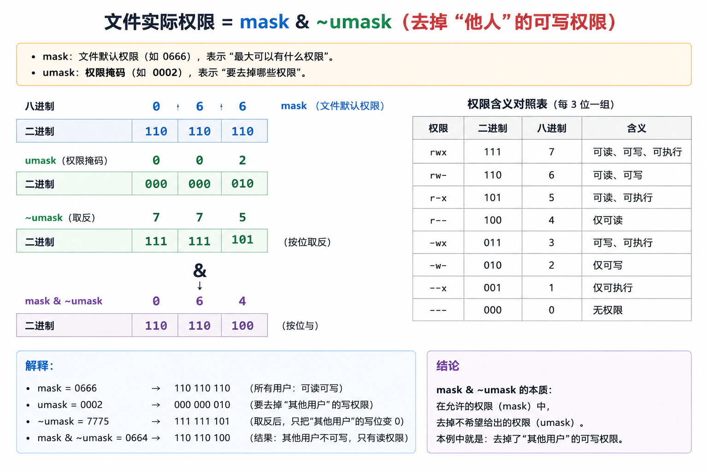
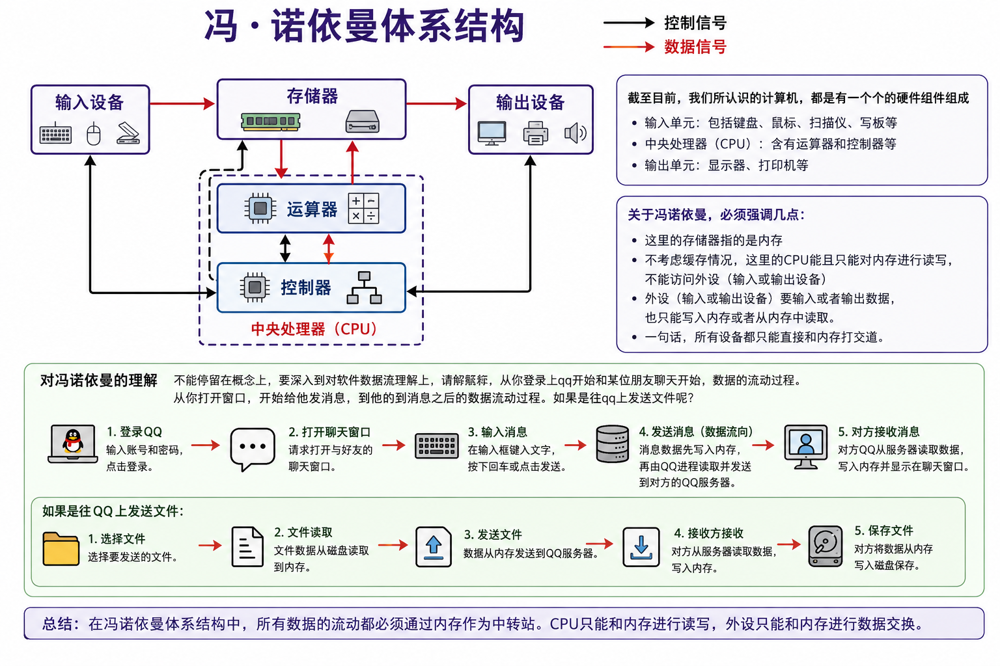
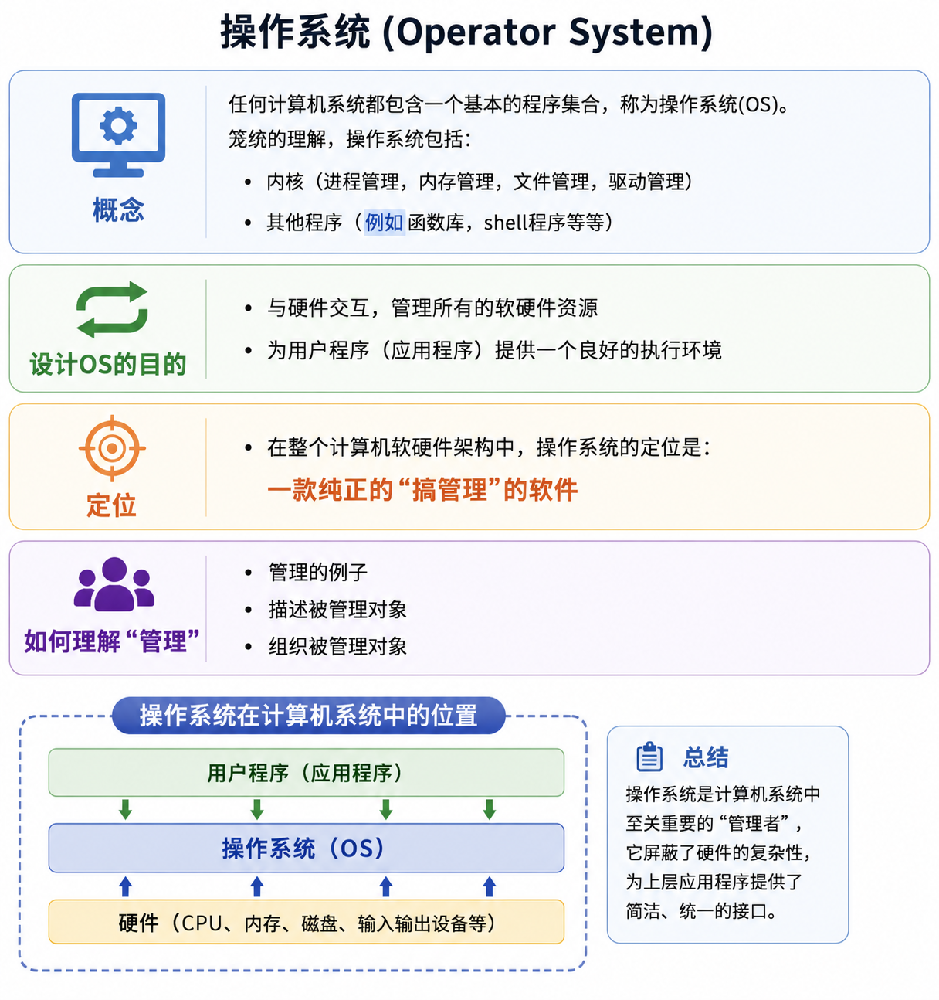
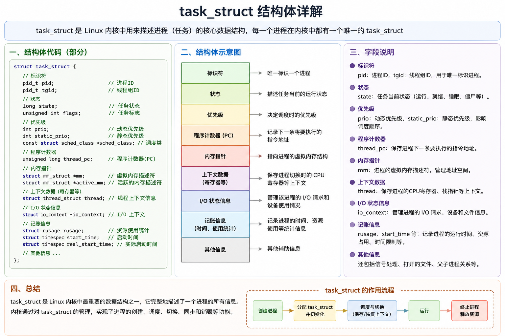
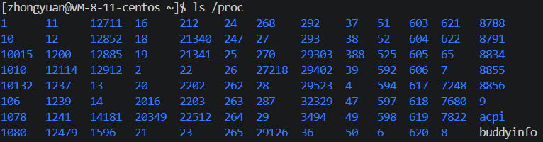
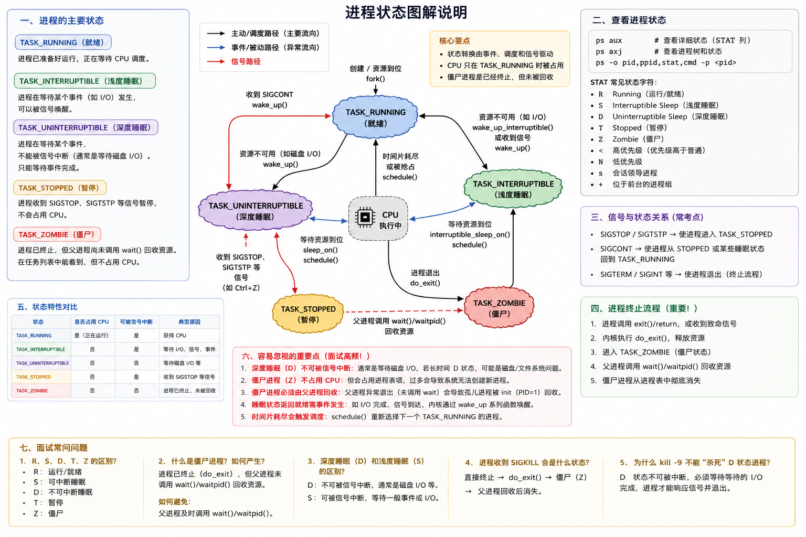
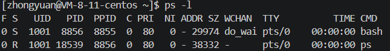
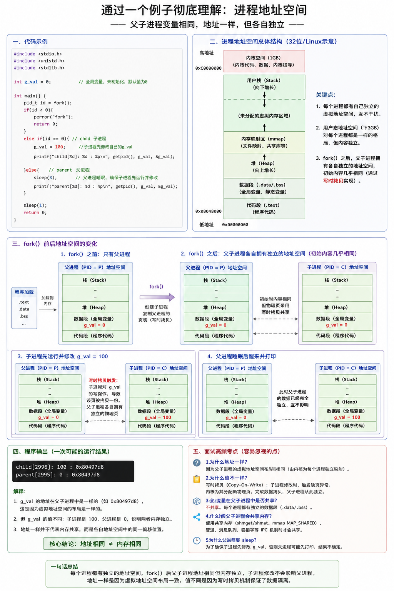

# 一、Linux权限的概念

## 1、用户权限
在linux之中有两种用户：**超级用户**和**普通用户**
- 超级用户在系统之中可以完成任何事情不需要任何限制。
- 在Linux下面完成任何事情，使用su命令可以进行用户的切换。 

## 2、文件权限
- 文件访问者可以分为三类：文件拥有者、文件拥有者所属组、其他
  
- 文件的访问类型和访问权限

### 2.1 关于 inode 与文件删除的核心概念

在 Linux 文件系统中，一个文件由两部分组成：

- **inode（索引节点）**：存储文件的元信息（如权限、所有者、时间戳、数据块指针等）
- **数据块（data blocks）**：存储文件的实际内容

我们平时看到的**文件名**，本质上只是一个指向对应 inode 的**硬链接**。

当我们执行 `rm` 删除一个文件时实际上会做两件事情：

1. 系统会**解除文件名与 inode 之间的链接关系**
2. 该 inode 的**链接计数（link count）减 1**

只有当 **inode 的链接计数降为 0** 时：
- 系统才会真正标记该 inode 和数据块为**可重用**
- 这部分磁盘空间才会被视为“空闲”，可以被后续写入覆盖
### 2.2 文件权限的表示方式
下面表格之中展现的是单独可读可写可执行的情况
| r(读权限) | w(写权限) | x(执行权限) |
|--------|--------|--------|
| 4 | 2 | 1 |
| 100 | 010 | 001 |

所以在我们修改文件权限的时候就可以有以下三种方法假设我们有一个文件`a.txt`
```bash
chmod 777 ./a.txt # 修改用户、所属组、其他对于文件的权限都为可读可写可执行
chmod u+w ./a.txt # 单独为用户增加可写权限
chmod +w ./a.txt  # 为用户、所属组、其他都增加上可写权限
```
### 2.3 初始文件权限如何产生？
我们会发现在文件创建完成之后就会自动拥有不同的权限，这是怎么做到的呢毕竟我们并没有直接进行设置过
一般我们新建文件和文件夹的默认权限都是如下所示
- 新建文件夹默认权限=0666 
- 新建目录默认权限=0777
假设我们的默认权限是`mask`那么我们实际创建出来的文件权限就是`mask &~umask`，`umask`就是掩码假设普通用户默认是0002。
```bash
# 假设我们当前是在进行文件创建
mask  = 0666
umask = 0002
mask &~umask就是
110 110 110
111 111 101
最终得到的就是
110 110 100
所以看成是去掉替他人的可写权限的一个过程
```
利用图表的形式进行更明确清晰的解释


### 2.4 文件夹的三个权限以及粘滞位
- 可读权限：表明了你是否可以使用`ls`查看文件夹内部的文件
- 可写权限：表明了你是否可以进行创建删除之类的操作
- 可执行权限：表明了你是否可以使用`cd`命令进入文件夹内部进行查看
但是我们会发现一个问题，就是只要我们拥有文件夹的可写权限就可以对其中的文件进行删除操作，这好像是非常不合理的。
所以我们加入粘滞位的概念
```bash
[root@localhost ~]# chmod +t /home/   # 加上粘滞位
# 现在这个文件夹之下的文件只能被以下三种用户进行删除
# 超级管理员删除
# 该目录的所有者删除
# 该文件的所有者删除
```
# 二、Linux进程控制
## 2.1 冯诺依曼体系结构
我们常见的计算机，服务器大都遵循冯诺依曼体系


## 2.2 操作系统的概念与定位
我对于操作系统的理解就是担任系统资源的分配，与硬件交互，管理所有的软硬件资源
操作系统包括内核和其他程序


## 2.3 进程概念和PCB
进程可以简单理解成一个正在执行的实例一个正在执行的程序，深入理解就是进程是一个分配系统资源（CPU时间和内存）的实体
那么我们知道操作系统是一个管理者的角色对进程这个也同样是，遵循一个标准流程，先描述再组织
这里的描述进程控制块(process control block)使用的是`task_struct`结构体，会被装载到RAM(内存)里并且包含着进程的信息。


我们可以使用指令来查看正在运行的所有进程,下方显示的蓝色的文字就是进程的PID

我们可以通过系统调用来获取进程标识符号
```c++
#include <stdio.h>
#include <sys/types.h>
#include <unistd.h>
int main()
{
    printf("pid: %d\n", getpid());
    printf("ppid: %d\n", getppid());// 这个是获取父进程PID
    return 0;
}
```
### 2.3.1 fork函数的认识
```
NAME
       fork - create a child process 创建一个子进程
SYNOPSIS
       #include <unistd.h>
       pid_t fork(void);
RETURN VALUE
       On success, the PID of the child process is returned in the parent, and 0 is returned in the child.  On failure, -1 is returned in the parent, no child  process  is
       created, and errno is set appropriately.
```
让我们来看一下代码部分如何实现,需要说的是父子进程代码是共享的，数据各自开辟空间，私有一份，不过这个是写时拷贝，只有当其发生变动的时候才会复制一份出去。
```c
#include <stdio.h>
#include <sys/types.h>
#include <unistd.h>
int main()
{
    int ret = fork(); // 在前面函数描述之中子进程返回的ret是父进程的PID，父进程返回的是0
    if(ret < 0){
        perror("fork");
        return 1;
    }
    else if(ret == 0){ //child
        printf("I am child : %d!, ret: %d\n", getpid(), ret);
    }else{ //father
        printf("I am father : %d!, ret: %d\n", getpid(), ret);
    }
    sleep(1);
    return 0;
}

/*
输出结果
[zhongyuan@VM-8-11-centos ~]$ ./test 
I am father : 12934!, ret: 12935
I am child : 12935!, ret: 0
*/
```
## 2.4 进程的多种状态
### 2.4.1 基本进程状态


### 2.4.2 僵尸进程的产生
僵尸进程（Zombie Process）：子进程完成任务已经中止之后返回任务码但是没有被父进程接收到。`task_struct`一直保留在这里需要操作系统进行维护，也无法用信号指令进行消除(因为`kill -9`的作用是终止一个正在运行的进程。而僵尸进程已经终止了，它只是在进程表里留了个"户口"，所以任何信号都无法影响它。)，一直占用系统资源也就是内存。
### 2.4.3 孤儿进程的产生
孤儿进程就是父进程已经提前先推出了但是这个时候子进程还在完成自己的任务所以导致的问题.不过这个时候孤儿进程会被领养。
## 2.5 进程调度优先级
关于进程调度的优先级，优先权高的进程有优先执行权利。配置进程优先权对多任务环境的linux有用，可以改善系统性能。
我们看向下面这张图片会看到两个值`PRI`、`NI`

- PRI：进程的优先级，决定CPU的先后执行顺序，数字越小优先级别也就越高
- NI：我更愿意称之为优先级修正值，也就是说新的优先级是这样得到的`PRI(new)=PRI(old)+nice`,所以当NI值越小的时候这个程序的优先级就会越高，取值范围是-20-19.
## 2.6 进程地址空间

需要补充的是地址空间描述的基本空间大小是字节32位下最多形成2^32次方个地址一个对应一个字节所以是4GB每一个字节都有唯一的地址（唯一性这也是地址最大的意义）。
虚拟进程地址空间是通过页表分配到为例内存之上。