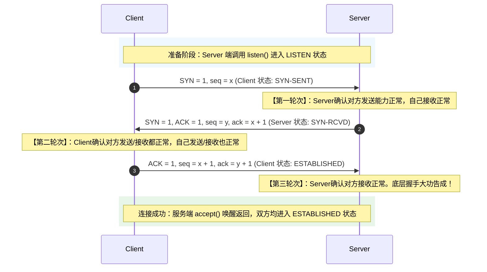
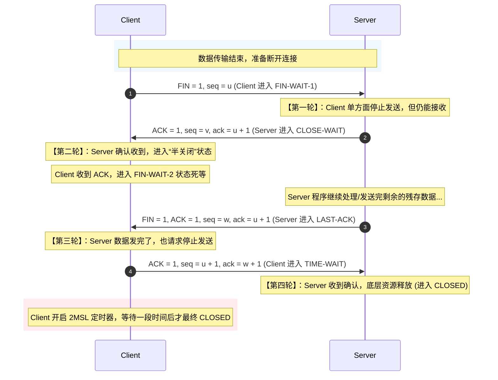

# Transmission Control Protocol从零理解到实践（传输控制协议）

## 1、为什么需要TCP
可以在一些特定的场景下面使用就比如
- 聊天软件
- 文件传输
- 浏览网页
- 登陆系统
我们不能允许在这样的过程之中有数据丢失的情况所以我们必须选用可靠传输
## 2、TCP的核心特点

TCP是网络编程之中最实用的。在实际的工程开发（例如编写底层的 `TcpClient` 和 `TcpServer` 通信框架）中，TCP 的以下五个特点影响着系统与多线程的架构设计：

### ① 面向连接（Connection-Oriented）
在两台主机进行数据交互之前，必须先建立一条端到端的可靠逻辑连接。
* **工程映射**：在代码层面上，这意味着在调用 `send()` 或 `recv()` 进行读写之前，服务端必须已经准备好 `listen()`，而客户端必须显式地调用 `connect()` 且成功返回。通信结束后，当调用 `close()` 时，并不会立即释放连接资源，而是由 TCP 协议栈发起四次挥手流程，等待双方确认关闭后，连接才最终被内核回收。

### ② 全双工通信（Full-Duplex）
TCP 连接允许通信双方在同一个时刻同时进行数据的发送和接收。
* **工程映射**：TCP 连接的两端都在系统内核中开辟了独立的发送缓冲区和接收缓冲区。在多线程并发场景下，这意味着你可以让一个线程专门阻塞读取（接收数据），另一个线程专门负责打包推送（发送数据），两者在同一套 Socket 描述符上互不干扰。

### ③ 面向字节流（Byte-Stream Oriented）
TCP 将应用程序交下来的数据仅仅看作是一连串无结构的字节流。它不保留应用层报文的边界，而是根据当前网络的 MTU（最大传输单元）自适应地进行拆分或合并发送。
* **工程映射**：这是网络编程中最容易踩坑的地方。底层收到数据时，可能是一半的报文，也可能是两个半报文拼在一起的。因此，开发者必须在应用层手动处理**“粘包”**与**“拆包”**问题（例如在报文头部加入固定长度的 Header 字段来标明包体长度）。

### ④ 可靠传输（Reliable Delivery）
TCP 承诺提供“无差错、不丢失、不重复、且按序到达”的传输保障。
* **工程映射**：TCP 内部集成了序列号（Sequence）、确认应答（ACK）和超时重传机制。对于应用层开发者而言，这意味着只需把数据丢进 Socket 缓冲区，TCP 协议栈会自动在底层死磕直到数据送达（或连接彻底断开报错），业务代码无需操心任何丢包重发逻辑。

### ⑤ 流量控制与拥塞控制（Flow & Congestion Control）
* **流量控制**：通过**滑动窗口（Sliding Window）**机制，接收方会动态告诉发送方自己还能吃下多少数据，防止发送方速度过快撑爆接收方的缓存。
* **拥塞控制**：通过慢启动、快重传等算法，动态感知整个互联网的拥堵程度，避免引发网络雪崩。

---

## 3、三次握手到底在做什么

**“三次握手（Three-way Handshake）”的本质，是通信双方在不可靠的网络信道上，通过三次极简的报文交互，确认彼此都具备“正常的发送能力”和“正常的接收能力”，并同步初始序列号（ISN）的过程。**

当服务端的 `accept()` 函数成功解除阻塞并返回一个新的 Socket 时，意味着底层内核已经默默帮你打完了这套三连招。我们可以将这个过程拆解为一场直白的心理博弈：


## 4、四次挥手到底在做什么

如果说“三次握手”是为了建立坚固的通信信任，那么**“四次挥手（Four-way Wavehand / Connection Teardown）”就是为了在彻底断开连接前，保证双方的数据都已经安全、完整地发送完毕。**

由于 TCP 是**全双工通信（Full-Duplex）**，即数据可以同时双向流动。这就好比一条双向车道，当你要封路时，必须单独封闭“东向西”的车道，再单独封闭“西向东”的车道。因此，**断开连接必须由双方各自发起一次关闭请求，并各自予以确认，这就构成了四次交互。**

我们可以通过以下的底层时序图与心理博弈，来深度拆解这个过程：


## 4、聊天室的实现
这里我将拆解成四部分进行说明，在具体的代码中进行详细的说明，将三次握手和四次挥手在代码中那一步实现进行说明。

### tcpServer.hpp

```c++
#pragma once

#include <iostream>
#include <string>
#include <functional>
#include <stdint.h>

// 将服务端进行改造实现多人聊天室的功能
#include <unordered_map>
#include <mutex>

namespace server
{
    class TcpServer; // 前置声明，因为回调定义里需要用到该指针
    
    // 升级后的回调函数签名：
    // 参数1：服务器对象指针 (this)
    // 参数2：发送消息的客户端专属文件描述符
    // 参数3：发送者的身份字符串 (例如 "127.0.0.1:47252")
    // 参数4：收到的消息体
    using ServiceCallback = std::function<void(TcpServer*, int, const std::string&, const std::string&)>;

    class TcpServer{
        private:
            uint16_t _port;             // 服务器绑定的端口号
            ServiceCallback _callback;  // 要使用的回调函数
        
            // 这里是与udp不同的地方
            int _listen_sockfd;         // 监听套接字 (TCP 特有：专门负责“迎宾”)
            bool _is_running;           // 控制服务器运行状态的开关

            // key: 客户端的描述符, value: 客户端的描述符（或者包含IP、Port的结构体）
            std::unordered_map<int, std::string> _online_clients; 
            std::mutex _mtx; // 保护通讯录的锁
        public:
            // 构造函数
            TcpServer(uint16_t _port,ServiceCallback _callback);
            ~TcpServer();

            // 1. 初始化服务器
            // 核心职责：完成 socket() -> bind() -> listen() 三步曲
            void InitServer();
            void Start();

            void Broadcast(int sender_fd, const std::string& sender_info, const std::string& message);
        private:
            // 3. 为单个连接的客户端提供服务 (内部辅助函数)
            // TCP 是面向连接的，拉到客之后，通常交由这个函数(或者新线程)去专心服务他
            void Service(int client_sockfd, const std::string& client_ip, uint16_t client_port);
    };
}
```

### tcpServer.cc

```c++
#include "tcpServer.hpp"
#include "log.hpp"
#include <sys/types.h>          
#include <sys/socket.h>
#include <string.h>
#include <netinet/in.h>
#include <arpa/inet.h>
#include <unistd.h>
#include <thread>

using namespace std;
// 构造函数，初始时传入端口号和业务逻辑(也就是回调函数，这直接就决定了这个服务器完成的任务)
server::TcpServer::TcpServer(uint16_t port, ServiceCallback cb)
    : _port(port), 
    _callback(cb),
    _listen_sockfd(-1),
    _is_running(false)
{
    // 完成目前所有初始工作
}

// 1. 初始化服务器
// 核心职责：完成 socket() -> bind() -> listen() 三步曲
void server::TcpServer::InitServer()
{
    // 1、创建套接字对应空间，这里的三个参数对应：1、你选用的是IPV4还是IPV6 2、选用的通信方式 3、通信协议
    _listen_sockfd = socket(AF_INET,SOCK_STREAM,0);
    if (_listen_sockfd < 0)
    {
        // 使用 FATAL 级别，像 printf 一样传入 %d 和 %s
        LogMessage(FATAL, "创建套接字失败! 错误码: %d, 描述: %s", errno, strerror(errno));
        // std::cout << "socket error" << errno << ":" << strerror(errno) << std::endl;
        // perror("socket");
        exit(1);
    }

    // 2、进行绑定 本质就是 “监听 socket + 本机 IP + 端口”
    struct sockaddr_in addr{}; // {}：这就是一个初始化的操作
    addr.sin_family = AF_INET; // 协议域
    addr.sin_port = htons(_port); // 因为我们的机器是分为大端传输和小端传输的，那么在网络传输的过程之中就要确定我们的读取方式，在网络之中我们规定使用大端传输，所以这句的意思就是端口号要转换成大端字节序的方式进行网络端的传输
    addr.sin_addr.s_addr = INADDR_ANY;// 任意IP地址

    if (bind(_listen_sockfd,(struct sockaddr *)&addr, sizeof(addr)) < 0 )
    {
        perror("bind");
        exit(1);
    }

    // 3、监听 (Listen) —— 这是 TCP 特有的
    // 5 表示全连接队列的长度，通常设置 5~128 都可以
    if (listen(_listen_sockfd, 5) < 0) 
    {
        perror("listen");
        exit(1);
    }

    LogMessage(NORMAL,"TCP 服务器启动成功，正在监听端口 %d", _port);
    // std::cout << "TCP Server started on port " << _port << std::endl;
    
}

// 2. 启动服务器
// 核心职责：进入死循环，调用 accept() 不断接收新客户的连接
void server::TcpServer::Start()
{
    _is_running = true;
    while (_is_running)
    {
        struct sockaddr_in clientaddr{};
        socklen_t len = sizeof(clientaddr);

        // 1、从等待队列之中拉去一个用户
        // RETURN VALUE
        // On success, these system calls return a nonnegative integer that is a descriptor for the accepted socket.  
        // On error, -1 is returned, and errno is set appropriately.
        /*
        我们所说的三次握手就在这个位置完成由内核自动进行发起
        客户端 connect()
                ↓
        内核自动发起三次握手
                ↓
        连接建立成功（内核完成）
                ↓
        服务器 accept() 才返回一个已连接 socket
        */
        int client_sockfd = accept(_listen_sockfd,(struct sockaddr*)&clientaddr,&len);
        if (client_sockfd < 0)
        {
            perror("accept error");
            continue; // 拉客失败没关系，继续拉下一个，不要让整个服务器崩溃
        }

        // 2、提取客户端的IP地址和端口号
        char ip_buf[32];
        // 把底层网络二进制转换成可读的字符串提取
        inet_ntop(AF_INET, &clientaddr.sin_addr, ip_buf, sizeof(ip_buf));
        // 转换IP和端口号
        std::string client_ip = ip_buf;
        uint16_t client_port = ntohs(clientaddr.sin_port);// 网络字节序转换成可读


        LogMessage(NORMAL, "新客户接入! IP: %s, 端口: %d, 分配FD: %d", client_ip.c_str(), client_port, client_sockfd);
        // std::cout << "\n[新连接建立] Client IP: " << client_ip 
        //           << ", Port: " << client_port 
        //           << ", 分配的单间 fd: " << client_sockfd << std::endl;
        
        // 3、链接建立完成开始提供服务端服务,这是一个只能一对一的版本，现在引入多线程概念去实现
        // Service(client_sockfd, client_ip, client_port);

        // 修改成多人在线聊天室
        // 登记：将新连接加入在线映射表
        {
            std::lock_guard<std::mutex> lock(_mtx); // 自动加锁/解锁
            _online_clients[client_sockfd] = client_ip + ":" + std::to_string(client_port);
        }

        // =========================================================
        // （开辟新线程）
        // 参数1：要执行的函数指针 (&TcpServer::Service)
        // 参数2：类成员函数需要传入的 this 指针
        // 参数3-5：传给 Service 函数的具体参数
        // =========================================================
        // 这里的fd只能传值，因为这是循环接收的假如我们传引用这个数值会一直改变
        std::thread t(&TcpServer::Service, this, client_sockfd, client_ip, client_port);
        // 执行完任务之后去析构掉
        t.detach();
    }
    
}

void server::TcpServer::Service(int client_sockfd, const std::string& client_ip, uint16_t client_port)
{
    char buffer[1024];
    std::string client_info = client_ip + ":" + std::to_string(client_port);
    // 单间的死循环：只要客人不走，我们就一直为他服务
    while (true)
    {
        // 1：接收数据 (TCP 通常用 recv 或 read)
        // 注意这里用的 fd 是客人专属的 client_sockfd，绝对不能用 _listen_sockfd！
        ssize_t n = recv(client_sockfd, buffer, sizeof(buffer) - 1, 0);

        if (n > 0)
        {
            // 正常收到消息
            buffer[n] = '\0';
            std::cout << "[" << client_ip << ":" << client_port << "] 说: " << buffer << std::endl;

            // 核心传递：将处理权限转交给顶层的回调逻辑函数
            _callback(this, client_sockfd, client_info, buffer);
        }
        else if (n == 0)
        {
            // ? 极其重要：在 TCP 中，recv 返回 0 代表对端（客户端）主动断开了连接！
            std::cout << "[" << client_ip << ":" << client_port << "] 正常退出，断开连接。" << std::endl;
            break; // 客人走了，结束这个死循环
        }
        else
        {
            // n < 0，发生网络错误（比如网线拔了）
            std::cout << "[" << client_ip << ":" << client_port << "] 发生异常，断开连接。" << std::endl;
            perror("recv error");
            break; // 同样必须退出死循环
        }
    }

    // 退出服务逻辑时，必须同时在映射表里擦除记录并回收文件描述符
    {
        std::lock_guard<std::mutex> lock(_mtx);
        _online_clients.erase(client_sockfd);
    }

    // ??? 致命重点：关门送客！
    // 只要退出了上面的循环，说明服务结束，必须立刻把单间钥匙还给操作系统！
    // 如果不写这一句，服务器运行一段时间后，所有的系统 FD 资源会被耗尽，服务器直接崩溃！
    close(client_sockfd);
}

server::TcpServer::~TcpServer()
{
}

// ===================================================================
// 业务逻辑层实现 (解耦展示)
// ===================================================================

// 回调函数A: 原路返回业务 (Echo)
void echoService(server::TcpServer* svr, int fd, const std::string& info, const std::string& msg)
{
    std::string response = "[Echo 应答]: " + msg;
    send(fd, response.c_str(), response.size(), 0);
}

// 回调函数B: 多人聊天室消息广播插件
void chatRoomService(server::TcpServer* svr, int fd, const std::string& info, const std::string& msg)
{
    // 调用由服务端底层公开的 Broadcast 方法推送
    svr->Broadcast(fd, info, msg);
}

// 🌟 实现底层的广播分发机制
void server::TcpServer::Broadcast(int sender_fd, const std::string& sender_info, const std::string& message)
{
    // 组装群聊广播报文格式
    std::string broadcast_msg = "[" + sender_info + "] 对大家说: " + message;

    std::lock_guard<std::mutex> lock(_mtx);
    for (auto& client : _online_clients)
    {
        // 将消息分发给除了发送端以外的所有在线套接字
        if (client.first != sender_fd)
        {
            send(client.first, broadcast_msg.c_str(), broadcast_msg.size(), 0);
        }
    }
}
int main()
{
    // 假设你目前先在本地进行自测，填 127.0.0.1
    // 如果要跨网测试，换成你服务器的公网 IP 即可


    server::TcpServer tcpserver(8888,chatRoomService);
    tcpserver.InitServer();
    tcpserver.Start();

    return 0;
}
```

### tcpClient.hpp
```c++
#ifndef UDP_CLIENT_HPP
#define UDP_CLIENT_HPP

#include <string>

class UdpClient {
public:
    UdpClient(const std::string& serverIp, int port);
    void run();

private:
    int sockfd;
    std::string serverIp;
    int port;
};

#endif
```

### tcpClient.cc
```c++
#include "tcpClient.hpp"
#include <iostream>
#include <sys/types.h>
#include <sys/socket.h>
#include <netinet/in.h>
#include <arpa/inet.h>
#include <unistd.h>
#include <cstring>

using namespace client;

TcpClient::TcpClient(const std::string& server_ip, uint16_t server_port)
    : _server_ip(server_ip), _server_port(server_port), _sockfd(-1), _is_running(false)
{
}

TcpClient::~TcpClient()
{
    _is_running = false;
    if (_sockfd >= 0)
    {
        close(_sockfd);
    }
}

void TcpClient::InitAndConnect()
{
    _sockfd = socket(AF_INET, SOCK_STREAM, 0);
    if (_sockfd < 0)
    {
        perror("socket creation failed");
        exit(1);
    }

    struct sockaddr_in server_addr{};
    server_addr.sin_family = AF_INET;
    server_addr.sin_port = htons(_server_port);
    
    if (inet_pton(AF_INET, _server_ip.c_str(), &server_addr.sin_addr) <= 0)
    {
        std::cerr << "无效的 IP 地址格式！" << std::endl;
        exit(1);
    }

    std::cout << "正在连接到服务器 " << _server_ip << ":" << _server_port << " ..." << std::endl;
    if (connect(_sockfd, (struct sockaddr*)&server_addr, sizeof(server_addr)) < 0)
    {
        perror("连接服务器失败 (connect failed)");
        exit(1);
    }

    std::cout << "🎉 成功连接到服务器！可以开始聊天了。\n" << std::endl;
}

// 新增的后台接收线程逻辑
void TcpClient::ReceiveLoop()
{
    char buffer[1024];
    while (_is_running)
    {
        // 这里的 recv 是独立的，完全不会被主线程的 getline 影响！
        ssize_t recv_bytes = recv(_sockfd, buffer, sizeof(buffer) - 1, 0);
        if (recv_bytes > 0)
        {
            buffer[recv_bytes] = '\0';
            // 收到广播消息，直接打印到屏幕上
            // 加上 \n 是为了尽量不破坏用户正在输入的命令行视图
            std::cout << "\n" << buffer << std::endl; 
        }
        else if (recv_bytes == 0)
        {
            std::cout << "\n⚠️ 服务器已主动关闭聊天室！按回车键退出。" << std::endl;
            _is_running = false;
            break;
        }
        else
        {
            // 只有在运行状态下出错才打印，防止正常 close 时误报
            if (_is_running) perror("\n与服务器连接异常断开");
            _is_running = false;
            break;
        }
    }
}

// 🌟 改造后的主线程：只负责发送
void TcpClient::StartChat()
{
    _is_running = true;

    // 🚀 核心改造：召唤一个后台专员（开辟子线程），让它去死循环监听服务器回信
    std::thread recv_thread(&TcpClient::ReceiveLoop, this);
    recv_thread.detach(); // 分离线程，让它在后台默默工作

    std::string message;
    // 主线程死循环：专注处理键盘输入和发送
    while (_is_running)
    {
        std::getline(std::cin, message);

        // 如果后台接收线程发现服务器断开了，主线程也应该及时退出
        if (!_is_running) break;

        if (message == "quit" || message == "exit")
        {
            std::cout << "主动退出聊天室..." << std::endl;
            _is_running = false;
            break;
        }
        if (message.empty()) continue;

        ssize_t send_bytes = send(_sockfd, message.c_str(), message.size(), 0);
        if (send_bytes < 0)
        {
            perror("发送失败");
            _is_running = false;
            break;
        }
    }

    // 退出前关掉套接字，这会同时触发 ReceiveLoop 里的 recv 退出阻塞
    if (_sockfd >= 0)
    {
        /*
        四次挥手发生在 close() 时
        recv() 返回 0
                ↓
        说明对方 close 了
                ↓
        你调用 close()
                ↓
        内核发 FIN 包（第一次挥手）
                ↓
        进入 TIME_WAIT 等状态
        */ 
        close(_sockfd);
        _sockfd = -1;
    }
}

// main 函数保持完全不变即可
int main()
{
    std::string server_ip = "127.0.0.1"; 
    uint16_t server_port = 8888;

    client::TcpClient cli(server_ip, server_port);
    cli.InitAndConnect();
    cli.StartChat();

    return 0;
}
```

| 阶段   | 发生位置      | 代码里的函数             |
| ---- | --------- | ------------------- |
| 三次握手 | 内核 TCP 栈  | connect / accept 之间 |
| 建立连接 | accept 返回 | accept()            |
| 数据传输 | 用户态       | recv / send         |
| 四次挥手 | 内核 TCP 栈  | close()             |
